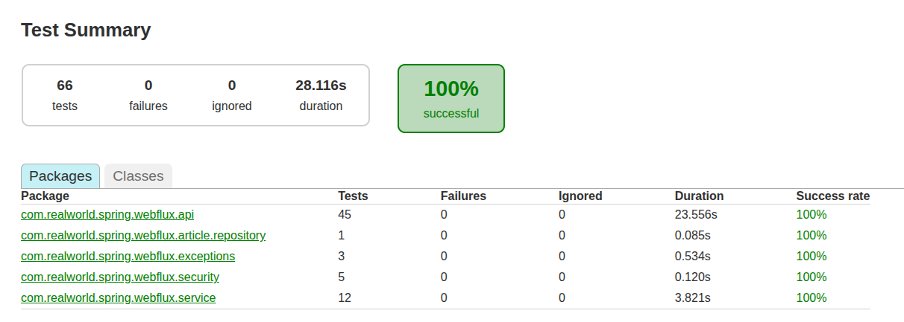
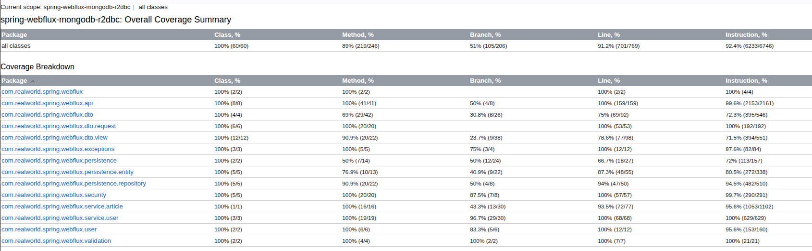

## tech stack
* java 25
* kotlin 2.3.0
* gradle 9
* spring boot 3

if you just want to run with spring boot 3, with a stable tech stack
* java 21 
* gradle 8.4+
* kotlin 2.2.20
There will be some minor dependency version changes though.

## mongodb 
configurations in build.gradle.kts
* dependencies section 
* application.yml
  - de.flapdoodle.mongodb.embedded.version: for mongodb version
  - logging.level.de.flapdoodle.embed.mongo: for logging
  - logging.level.org.mongodb.driver: for logging

### why mongodb version matters (need 6.0.4+)
Some newer linux distribution, for example ubuntu 22 or later, requires spring boot configure mongodb to 
version 6.0.4 or later (not the embedded mongodb version) for embedded mongodb.  

This is due to mongodb's dependency on the openSSL provided the host OS. Newer linux distribution 
usually ships with libssl 3+. However, mongodb 6.0.4 and before uses libssl 1.1. This causes the embedded mongo 
unable to establish the connection to the client.

To find if this is an issue with your OS, you can run `ldconfig -p | grep ssl`. This is what you will get from
ubuntu 24

```
	libssl3.so (libc6,x86-64) => /lib/x86_64-linux-gnu/libssl3.so
	libssl.so.3 (libc6,x86-64) => /lib/x86_64-linux-gnu/libssl.so.3
	libssl.so (libc6,x86-64) => /lib/x86_64-linux-gnu/libssl.so
	libhiredis_ssl.so.1.1.0 (libc6,x86-64) => /lib/x86_64-linux-gnu/libhiredis_ssl.so.1.1.0
```

Solution: use 6.0.4 and later version of mongodb. These versions of mongodb uses libssl3. for example, 
add this line to the application.yml file
`de.flapdoodle.mongodb.embedded.version: 6.0.5`

### embedded mongo db configuration key changes in spring boot 3 
need use `de.flapdoodle.mongodb.embedded.version: 6.0.5` instead of `spring.mongodb.embedded.version: 3.5.5` in application.yml

## test reports
configurations in build.gradle.kts:
1. plugins section
2. kover section

test report, default location: [project root]/build/reports/tests/test/index.html
# 
coverage report, default location: [project root]/build/reports/kover/html/index.html:
# 


